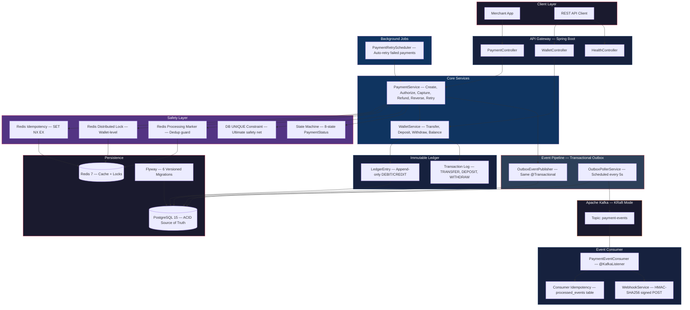
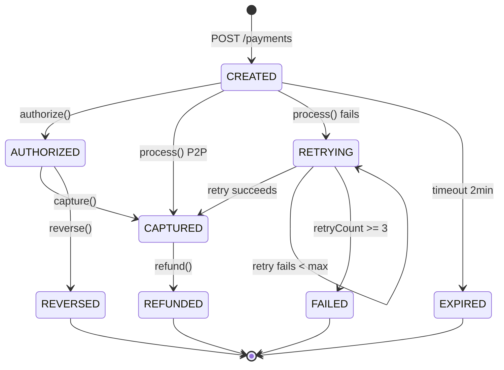
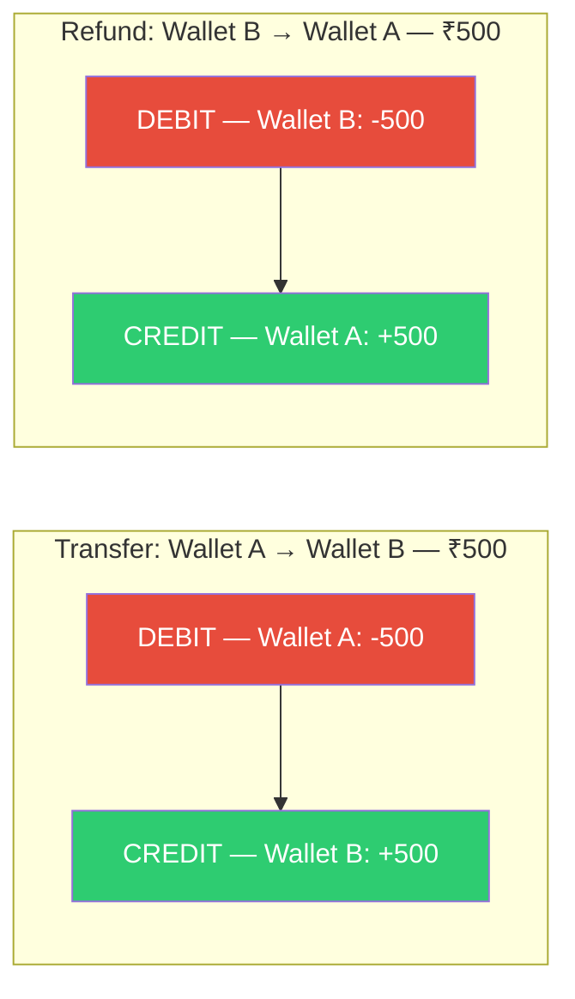
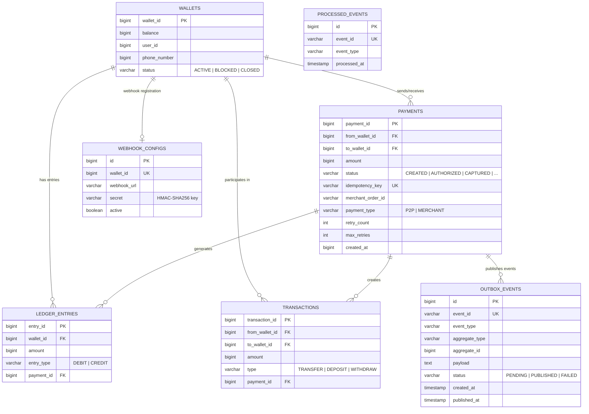

<div align="center">

# 💳 Distributed Payment Processing Engine

### Production-Grade Fintech Backend with Immutable Ledger

[](https://openjdk.org/)
[](https://spring.io/projects/spring-boot)
[](https://www.postgresql.org/)
[](https://redis.io/)
[](https://kafka.apache.org/)
[](https://www.docker.com/)

> A backend system modeling how **Stripe**, **Razorpay**, and **Adyen** process money — featuring immutable double-entry ledgering, three-layer idempotency, distributed locking, event-driven architecture via transactional outbox pattern, and HMAC-signed webhook delivery.

**[Explore the API »](http://localhost:8080/swagger-ui/index.html)** · **[Report Bug](https://github.com/partht999/Distributed-Payment-Processing-Engine-With-Ledger-/issues)**

---

</div>

## 🏗️ System Architecture



---

## 🔄 Payment Lifecycle State Machine

Every payment transitions through a strict state machine — **no invalid transitions are possible**.



---

## ✨ Key Features

| Feature | Description |
|:--------|:------------|
| **Payment Lifecycle** | Create → Authorize → Capture → Refund → Reverse with strict state machine guards |
| **Immutable Double-Entry Ledger** | Append-only DEBIT/CREDIT bookkeeping — balance derived from history, never blindly stored |
| **Three-Layer Idempotency** | Redis SET NX (fast) → DB UNIQUE constraint (safe) → App-level check (defensive) |
| **Distributed Locking** | Redis-based wallet-level locks prevent concurrent double-spend |
| **Transactional Outbox Pattern** | Events saved atomically with payment state — zero event loss even if Kafka is down |
| **Kafka Event Streaming** | KRaft-mode Kafka with key-based partitioning for ordered event delivery |
| **Consumer Idempotency** | `processed_events` table deduplicates Kafka's at-least-once delivery |
| **HMAC-SHA256 Webhooks** | Merchant notifications with cryptographic signature verification |
| **Graceful Degradation** | Redis down? System falls back to DB-only mode. Kafka down? Events wait in outbox |
| **Automated Retry** | Background scheduler retries failed payments with max-retry guard |
| **Merchant Auth+Capture** | Two-phase authorization flow for merchant integrations |
| **Payment Expiry** | Auto-expire stale CREATED payments after 2-minute window |
| **Flyway Migrations** | 6 version-controlled SQL migration scripts |
| **Swagger/OpenAPI** | Interactive API documentation via SpringDoc |
| **Docker Compose** | One-command infrastructure: PostgreSQL + Redis + Kafka |

---

## 🛡️ Reliability Patterns

### Idempotency — Zero Duplicate Charges

```
Request 1: POST /api/v1/payments  { idempotencyKey: "abc-123" }
Response:  201 Created → Payment #42

          ⚡ Network timeout — client retries...

Request 2: POST /api/v1/payments  { idempotencyKey: "abc-123" }  ← same key
Response:  201 Created → Payment #42  ← SAME payment, NOT duplicated
```

**Three layers of protection:**
1. **Redis** — `SET idempotency:abc-123 NX EX 300` — sub-millisecond duplicate detection
2. **PostgreSQL** — `UNIQUE` constraint on `idempotency_key` — permanent safety net
3. **Application** — `findByIdempotencyKey()` check — defensive coding

### Transactional Outbox — Zero Event Loss

```
┌─────────────────────────────────────────────────────────────────┐
│  @Transactional                                                 │
│  paymentRepo.save(payment)     ← DB write #1                   │
│  outboxRepo.save(outboxEvent)  ← DB write #2 (SAME transaction)│
│  COMMIT                        ← Both succeed or both fail     │
└─────────────────────────────────────────────────────────────────┘
         │
         ▼  Every 5 seconds (OutboxPollerService)
┌─────────────────────────────────────────────────────────────────┐
│  SELECT * FROM outbox_events WHERE status = 'PENDING'           │
│  kafkaTemplate.send("payment-events", payload).join()           │
│  event.markPublished()                                          │
└─────────────────────────────────────────────────────────────────┘
         │
         ▼
┌─────────────────────────────────────────────────────────────────┐
│  @KafkaListener → PaymentEventConsumer                          │
│  Check processed_events (idempotency) → WebhookService.dispatch │
└─────────────────────────────────────────────────────────────────┘
```

### Graceful Degradation

| Component Down | System Behavior |
|:--------------|:----------------|
| **Redis** | Falls back to DB UNIQUE constraint for idempotency. Skips distributed lock (DB guards still active). Logs WARN. |
| **Kafka** | Events stay safely in `outbox_events` table (status=PENDING). Poller retries on next cycle. |
| **Webhook endpoint** | Delivery failure logged. Consumer still marks Kafka offset. |

---

## 📒 Ledger Design — The Financial Source of Truth

The ledger is **append-only** and **immutable**. No entry is ever updated or deleted.



**Why immutable ledgering?**

| Traditional Approach ❌ | This Engine ✅ |
|:------------------------|:--------------| 
| `UPDATE wallet SET balance = balance - 100` | Append `DEBIT` entry, derive balance from history |
| History is lost on update | Every financial event is permanently recorded |
| Silent corruption possible | Corrections happen via compensating entries |
| Cannot reconstruct past state | Full audit trail — balance at any point in time |

**Invariants:**
- Every transfer creates exactly **one DEBIT + one CREDIT** (balanced)
- No ledger entry is ever modified after commit
- Every entry links to a `paymentId` for traceability
- Wallet balance is **derived** from ledger sum, never blindly stored

---

## 🗂️ Database Schema



---

## 🔌 API Reference

### 💰 Payment APIs

| Method | Endpoint | Description |
|:------:|:---------|:------------|
| `POST` | `/api/v1/payments` | Create a new payment |
| `GET` | `/api/v1/payments/{id}` | Get payment by ID |
| `GET` | `/api/v1/payments` | List all payments |
| `POST` | `/api/v1/payments/{id}/process` | Process (execute) a payment |
| `POST` | `/api/v1/payments/{id}/authorize` | Authorize merchant payment |
| `POST` | `/api/v1/payments/{id}/capture` | Capture authorized payment |
| `POST` | `/api/v1/payments/{id}/refund` | Refund captured payment |
| `POST` | `/api/v1/payments/{id}/reverse` | Reverse authorized payment |

### 👛 Wallet APIs

| Method | Endpoint | Description |
|:------:|:---------|:------------|
| `POST` | `/api/v1/wallets` | Create wallet |
| `GET` | `/api/v1/wallets/{id}` | Get wallet details |
| `GET` | `/api/v1/wallets/{id}/balance` | Get wallet + ledger-derived balance |
| `POST` | `/api/v1/wallets/{id}/deposit` | Deposit funds |
| `POST` | `/api/v1/wallets/{id}/withdraw` | Withdraw funds |
| `GET` | `/api/v1/wallets` | List all wallets |

### 🏥 Health

| Method | Endpoint | Description |
|:------:|:---------|:------------|
| `GET` | `/api/v1/health` | Health check with infrastructure status |

> 📖 **Interactive docs:** [http://localhost:8080/swagger-ui/index.html](http://localhost:8080/swagger-ui/index.html)

---

## 🚀 Quick Start

### Prerequisites

- Java 17+
- Docker & Docker Compose
- Git

### 1. Clone & Start Infrastructure

```bash
git clone https://github.com/partht999/Distributed-Payment-Processing-Engine-With-Ledger-.git
cd Distributed-Payment-Processing-Engine-With-Ledger-/payment_engine

# Start PostgreSQL + Redis + Kafka
docker compose up -d
```

### 2. Run the Application

```bash
./mvnw spring-boot:run
```

### 3. Test the Full Pipeline

```bash
# Create wallets
curl -X POST http://localhost:8080/api/v1/wallets \
  -H "Content-Type: application/json" \
  -d '{"walletId": 1, "balance": 10000, "userId": 101}'

curl -X POST http://localhost:8080/api/v1/wallets \
  -H "Content-Type: application/json" \
  -d '{"walletId": 2, "balance": 5000, "userId": 102}'

# Create & process a P2P payment
curl -X POST http://localhost:8080/api/v1/payments \
  -H "Content-Type: application/json" \
  -d '{"fromWalletId": 1, "toWalletId": 2, "amount": 500, "idempotencyKey": "txn-001", "paymentType": "P2P"}'

curl -X POST http://localhost:8080/api/v1/payments/1/process

# Verify ledger-derived balance
curl http://localhost:8080/api/v1/wallets/1/balance

# Test idempotency — same key returns same payment
curl -X POST http://localhost:8080/api/v1/payments \
  -H "Content-Type: application/json" \
  -d '{"fromWalletId": 1, "toWalletId": 2, "amount": 500, "idempotencyKey": "txn-001", "paymentType": "P2P"}'
# Returns SAME payment — no duplicate charge!
```

### 4. Run Tests

```bash
./mvnw test
```

---

## 📁 Project Structure

```
payment_engine/
├── docker-compose.yml                    # PostgreSQL + Redis + Kafka (KRaft)
├── pom.xml                               # Maven + Spring Boot 4.0
└── src/
    ├── main/java/com/distributed/payment_engine/
    │   ├── PaymentEngineApplication.java
    │   ├── config/
    │   │   ├── FlywayConfig.java           # Flyway migration config
    │   │   ├── OpenApiConfig.java          # Swagger/OpenAPI setup
    │   │   └── RedisConfig.java            # Redis connection + pool
    │   ├── controller/
    │   │   ├── HealthController.java       # Health check endpoint
    │   │   ├── PaymentController.java      # Payment REST API
    │   │   └── WalletController.java       # Wallet REST API
    │   ├── service/
    │   │   ├── PaymentService.java         # Core payment orchestration (437 lines)
    │   │   ├── WalletService.java          # Transfers + ledger entries
    │   │   ├── RedisIdempotencyService.java      # Redis SET NX idempotency
    │   │   ├── RedisDistributedLockService.java  # Wallet-level locks
    │   │   ├── RedisProcessingMarkerService.java # Dedup processing guard
    │   │   ├── OutboxEventPublisher.java   # Transactional outbox writer
    │   │   ├── OutboxPollerService.java    # Polls outbox → publishes to Kafka
    │   │   ├── PaymentEventConsumer.java   # @KafkaListener consumer
    │   │   ├── WebhookService.java         # HMAC-signed webhook dispatch
    │   │   ├── PaymentEventPublisher.java  # Publisher interface
    │   │   └── LoggingEventPublisher.java  # Fallback publisher
    │   ├── model/
    │   │   ├── entity/                     # 7 JPA entities
    │   │   ├── dto/                        # 6 request/response DTOs
    │   │   ├── enums/                      # 8 status/type enums
    │   │   └── event/                      # PaymentEvent domain event
    │   ├── repository/                     # 7 Spring Data JPA repositories
    │   ├── scheduler/
    │   │   └── PaymentRetryScheduler.java  # Automated retry background job
    │   └── exception/                      # Global error handling
    ├── main/resources/
    │   ├── application.properties          # All configuration
    │   └── db/migration/                   # 6 Flyway SQL migrations
    └── test/java/                          # 6 test classes, 42+ test methods
```

---

## 🧪 Test Coverage

| Test Class | What It Tests | # Tests |
|:-----------|:-------------|:-------:|
| `PaymentIntegrationTest` | Full payment lifecycle E2E (create, process, refund, idempotency) | 12 |
| `RedisIntegrationTest` | Redis idempotency, caching, failure handling | 10 |
| `DistributedLockTest` | Concurrent payment protection with Redis locks | 8 |
| `IdempotencyTtlTest` | TTL expiration and key reuse behavior | 6 |
| `ProcessingMarkerTest` | Processing dedup guard behavior | 5 |
| `PaymentEngineApplicationTests` | Spring context loads successfully | 1 |

```bash
# Run all tests (Docker must be running)
./mvnw test

# Run specific test class
./mvnw test -Dtest=PaymentIntegrationTest
```

---

## 🧠 Design Decisions

| Decision | Rationale |
|:---------|:----------|
| **Modular monolith** | Financial correctness over premature microservice splitting |
| **PostgreSQL as source of truth** | ACID guarantees essential for money movement |
| **Redis as cache layer** | Fast idempotency + locking, with graceful degradation when down |
| **Kafka with Outbox** | At-least-once delivery without dual-write risk |
| **KRaft mode** | No ZooKeeper dependency — simpler Kafka deployment |
| **Ledger-derived balance** | Wallet balance column is a cache; ledger is immutable truth |
| **Integer amounts** | Stored in smallest currency unit (paise/cents) — no floating point errors |
| **Enum state machine** | Compile-time safety for payment status transitions |
| **HMAC-SHA256 webhooks** | Same pattern as Stripe/Razorpay — merchant can verify authenticity |
| **`@Transactional` boundaries** | Payment + ledger + outbox event in a single atomic commit |

---

## 🧩 What This Project Demonstrates

<table>
<tr>
<td width="50%">

### 🏛️ System Design
- Distributed systems patterns (outbox, DLQ, idempotency)
- Financial correctness with immutable ledger
- State machine driven payment lifecycle
- Event-driven architecture with Kafka
- Failure-aware design with graceful degradation

</td>
<td width="50%">

### ⚙️ Backend Engineering
- Java 17 + Spring Boot 4.0
- JPA/Hibernate with PostgreSQL
- Spring Data Redis for caching + locking
- Spring Kafka for event streaming
- Flyway for version-controlled migrations

</td>
</tr>
<tr>
<td>

### 🛡️ Reliability Patterns
- Three-layer idempotent API design
- Redis distributed locking (wallet-level)
- Transactional outbox (zero event loss)
- Automated retry with max-retry guard
- Consumer-side deduplication

</td>
<td>

### 📊 Data Engineering
- Immutable double-entry ledger
- Ledger-derived balance computation
- Append-only audit trail
- Integer-based money representation
- 7 normalized tables with proper indexing

</td>
</tr>
</table>

---

<div align="center">

### Built by [partht999](https://github.com/partht999)

⭐ Star this repo if you found it useful!

</div>
